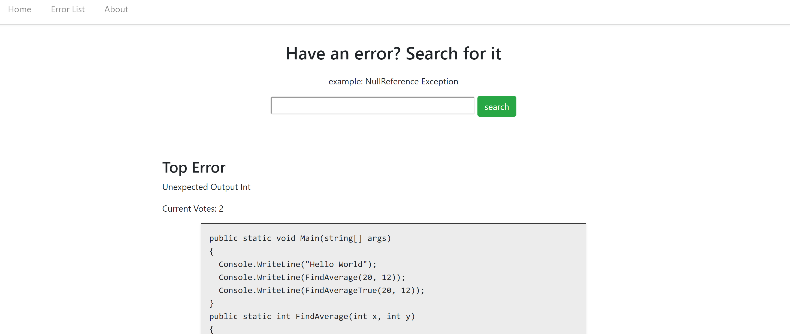
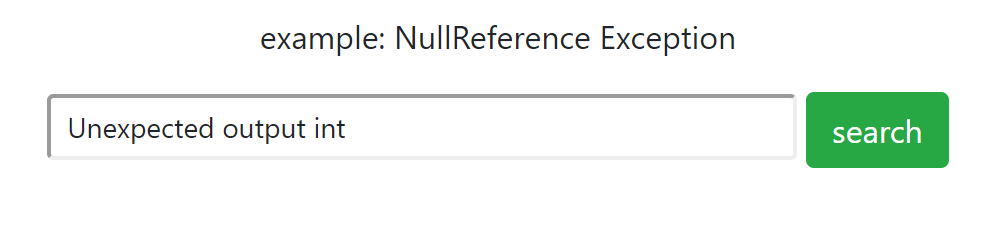
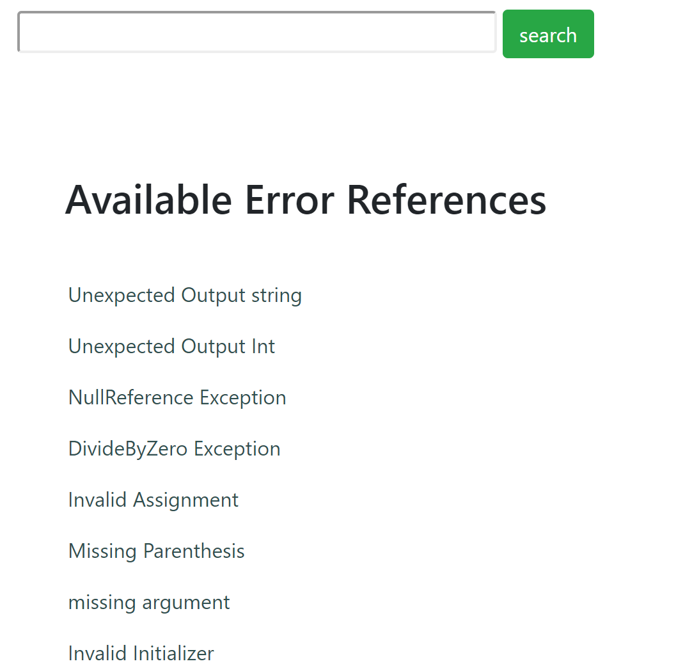
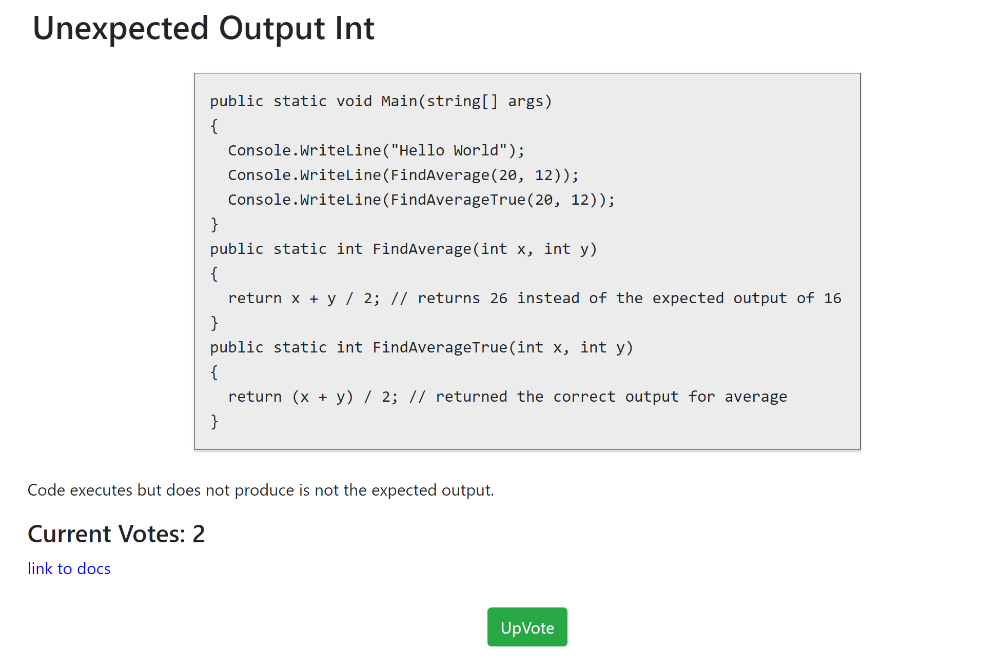
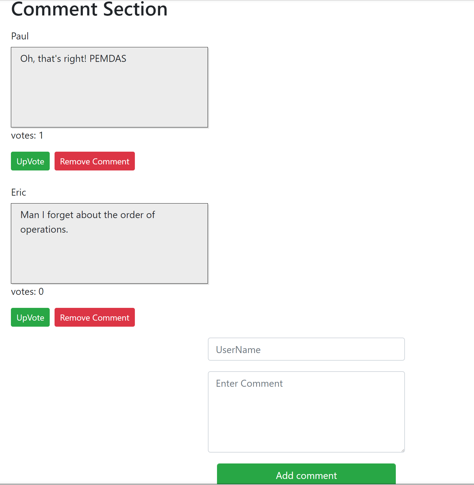

# Syntacs Full CRUD mvc application 
This is the repository for the Full CRUD web application Syntacs. This application was designed as an entry point for beginning developers to quickly find succinct answers to their errors. 

Most of the time, documentation can be dry and filled with theory and Syntacs is here to say "that is your error, and it usually happens like this."
***
# Getting Started
In order to run this locally, you'll need to get a few things situated:
1.	Download the files from the repository. You can use an IDE of your choice but we recommend Visual Studio.
2. This application is built usind the latest .Net core SDK and also uses EntityFramework Core for Code-first migrations
3.	This site uses the Broken API that retrieves all the error references and a user and comment database that lives on the application side itself.

* Visit the site [here](http://syntacs.azurewebsites.net/)

# Tests

This application uses xUnit for unit tests and has tests checking calls to the API and for the built-in database methods that live on the site. Several tests rely on the current API information that exists so if naming conventions change, adjustments will need to be made.

***
# Data Flow

When you first visit the site, you will see a navigation bar with a Home
tab, Error List tab and an About tab. Below that you will see a search bar along with a Top Error. This top error is voted on by users who have deemed that has been the error that has been the most experienced.

Two ways you can search for an error:
* Enter in a specific error through the search feature and if the reference is there, it will take you to the correct error or if it is not currently in the API, it will take you to a custom bad request page***

* Either click search with an empty input or the Error List Tab to see the current available list of Error References. From the list, you can either type in the error name or click on the name to be taken to the error view.

##### *** ***Note currently the api accepts only explicit requests. Any misspellings will cause a search request to be not found. Not case sensitive*** ***

After selecting an error, you will be taken to the error view page and shown a succinct example and description of that error. You will also see a vote counter as well as a link to documentation if the user wants to dive deeper. Some types of errors won't have documentation due to their nature or will be linked to a general overview of error types such as Logic Errors as those are case-by-case and not always specific.

Below is a comment section where users can leave remarks about whether this example was useful or for general community engagement with other developers. To follow CRUD operations, users can create a comment, read the comments left by users on the error, upvote (put) on a comment to update it as well as remove user comments.

***