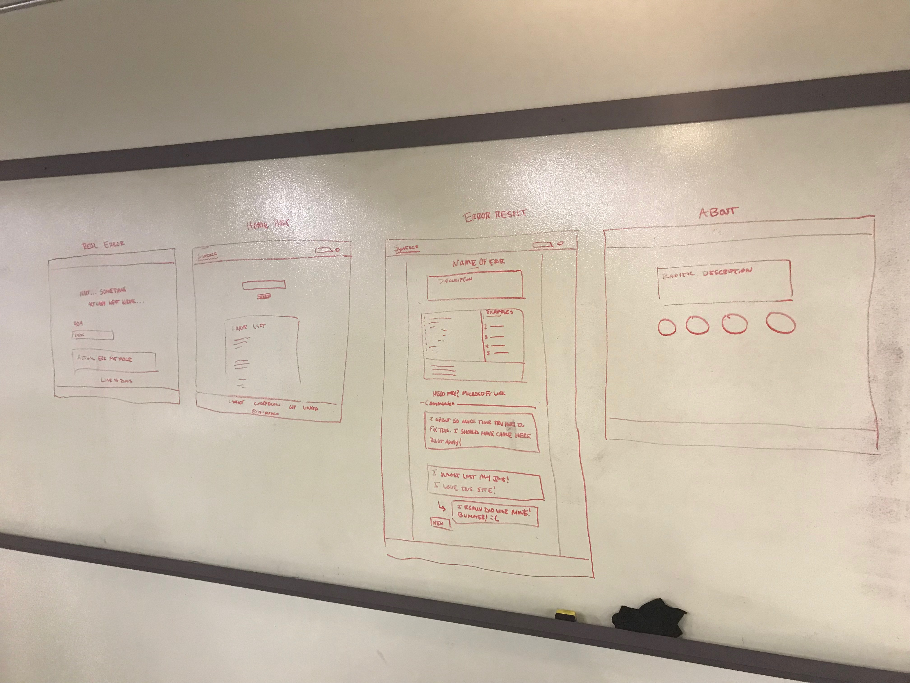
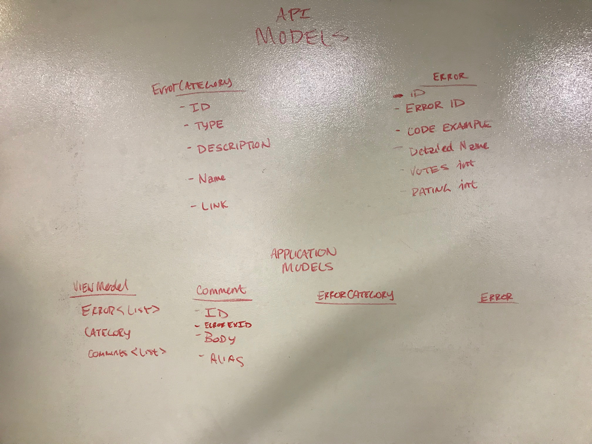

# Software Requirements
## Syntacs

 ### Vision
Syntacs is a website that is designed to be an entry point for new developers and quick reference for veterans that provides succinct documentation about the various error types and possible causations of those error types. It removes the necessity to skim through various dry references and help optimize development and education while continuing to provide direct access to in depth documentation should more be required. Syntacs also promotes the ability for users to comment and vote on the various examples to showcase to the community what frequently causes a specific error. This site is by developers, for developers and for the common goal to get straight to the point to find out why a snippet of code is broken.
***
### Scope (In/Out)
IN
- Search: Users can search for error keywords
- Display: A succinct description of the error
- Display: Example code with expected error message from compiler
- Display: Link to official MS documentation
- Comments: User can leave remarks about experience

OUT
- Provide documentation/examples for other languages (C# only reference for this iteration)
- Not a social media platform. Only designed for educational purposes
- Allow users to create personal accounts
***
### MVP
Syntacs Full CRUD MVC application -
A website that interacts with the Broken API, a user will be able to search for specific errors and then be shown a simplified version of that error. Users will be able to upvote examples as well as leave informational comments for each error that is stored with a database on the app side. It will also include an about page which has an explanation and intent of this specific project.

Broken API -
This API will hold references to the different categories of errors (exceptions, infinite loops, etc.) and examples that are connected to those errors. Users will be able to add examples to the errors, but not change error types as those will be pre-determined. 

### Stretch
- Adding functional compiler to run code examples or experiment
- Error highlighting within code examples
- Sharing error examples (twitter, facebook, etc.)
- Rating: Users can rate examples (1 - 5 stars)
***
### Functional Requirement
Errors can be searched for by users.
App displays information for said error.
Links are presented for the specified error which redirect users to the relevant Microsoft Docs pertaining to that error.
App displays examples of code that suffers from the specified error.
Code examples can be upvoted and commented upon by users.

### Non-Functional Requirement
Usability
Testability
Scalability
Maintainability
Code Readability
Code Understandability

Testability -  Code and Broken code examples will still follow valid test procedures to ensure their validity. It will test the software itself and the methods that are used within the application. 
Usability - It is designed to improve the learning process by directly decreasing the amount of time to search for a given error(Logical,Runtime and Syntax). It creates a satisfying experience by providing succinct information and then links for the appropriate continuation of research
***
### Data Flow
#### 1. Home Page
1.1 - User lands on the website, and has access to a search bar and a current top favorite error.

1.2 - If the user inputs a key word into the search bar, a HTTP-GET request is sent to the Broken API and Syntacs databases.

1.3 - The search term is used to filter out the specific error requested by the user and when the error is found in the Broken API, it will join together with code examples within the Broken API and comments connected to those examples on the Syntacs database

1.4 - This result will then be set inside of ViewModel that will be used to correctly display the information on the client side with a successful response

1.5 - If the user selects the top favorite error, they will be redirected through the same process but with an already predetermined error for the ViewModel

#### 2. Error Result Page (The expected page)
2.1 - On the error result page, the user will have the ability to see a short and succinct description of the given error, a code example that can produce that error, a small console log with a run button to simulate what the exact error will read as, other examples linked to the specific error, links to Microsoft docs and comments below that.

2.2 - User will have the ability to upvote a code example tied to the current error which can signify several things:
   * User appreciates example
   * Example is a frequent cause of specific error
   * Example provides an explicitly clear definition of the error
This is stored and updated via an HTTP-PUT request to the Broken API.

2.3 - Interacting with the run button will perform CSS/JavaScript transitions that will simulate the interaction of a runtime. The user will then be shown the exact error message to be expected in the compiler.

2.4 - Users will have the ability to go to the Microsoft Docs via a given link below the entire example. This is for those who wish to have more explanation and detail about the specific error.

2.5 - Users will have the ability to engage with the community by leaving comments on error examples. These are submitted via an HTTP-POST on the Syntacs database which will store a given alias, comment and the error ID of the current error so comments can be reloaded with the page.

2.6 - Users will have the ability to remove comments through an HTTP-DELETE that are deemed inappropriate and remove them from the Syntacs database.

2.7 - Comments also will have an upvote feature that is saved on the Syntacs database via a HTTP-PUT so users can engage in friendly conversations

2.8 - Links to more examples for the same kind of error will be provided to the user in the View as well. The examples consist of different ways to invoke the same kind of error and potentially may be a better answer to the user's current problem

#### 3. Error Page (If site actually breaks)

3.1 - If the user makes a bad request, the will be redirected to a specific error corresponding to the appropriate http error. This includes status codes of 400 and 500 and also will provide documentation for further research

3.2 - These views will also be clear in informing the user that something has actually gone wrong to avoid confusion with the documented errors
***
### Wireframes 

Wireframe for site layout

Wireframe for different tables both on the Broken API and Syntacs database

